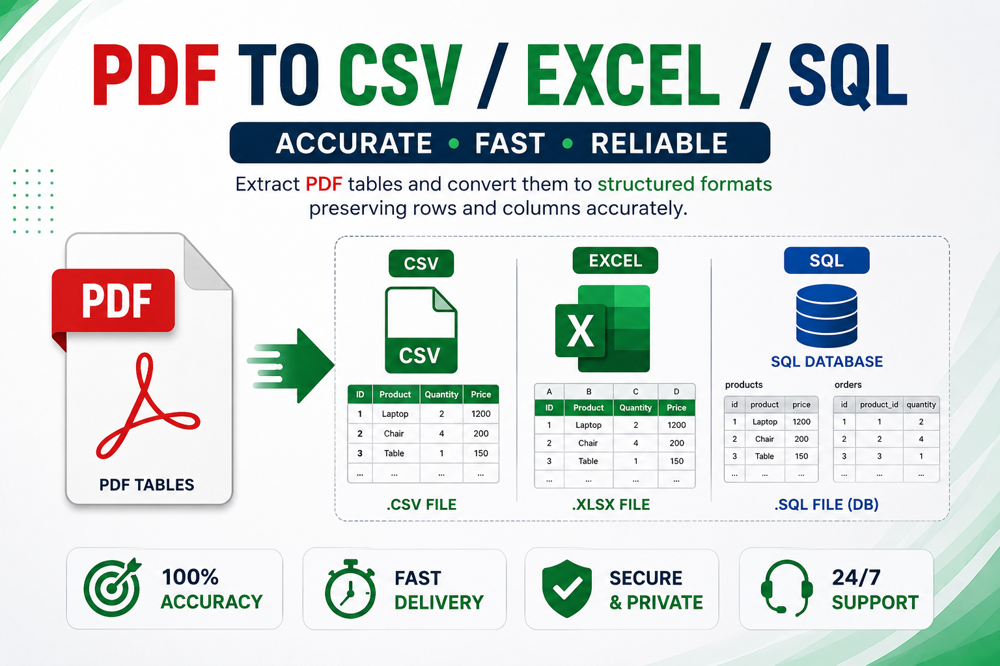

# PDFTool

Extract PDF tables and convert them into structured datasets.

## Features
✓ PDF table extraction
✓ CSV export
✓ Excel export
✓ SQL database export
✓ Report generation

Workflow:

PDF → DataFrame → CSV / Excel / SQL

PDF Table Extraction Tool

Python project for extracting tables from PDF files and converting them into structured datasets.

Features:

✓ Extract tables from PDF files
✓ Convert tables to pandas DataFrames
✓ Export to CSV
✓ Export to Excel
✓ Export to SQL database
✓ Merge multiple tables
✓ Clean numeric columns

Tools Used:

- Python
- pandas
- sqlite3
- FPDF
- PDFTool

Example workflow:

PDF → Table Extraction → DataFrame → CSV / Excel / SQL
